# Cargo E-Bike ABS vs Cadence Braking — Simulation Study

## Context

The user is conducting a 1D simulation study to investigate whether an **ABS** system provides meaningful benefit over **cadence braking** on a **cargo e-bike**. They have a block diagram, partial equations, and external review feedback identifying gaps. Claude is to fill in the remaining equations, implement the simulation in Python, and maintain the project on GitHub with regular commits.

**Key modeling assumption:** front-only braking. Rear wheel has slip ratio = 0 and rolls at $v / R_r$, making it a free speed reference for the ABS estimator.

## Repository

- **Name:** `cargo-ebike-abs-sim`
- **Owner:** `wannaBeTheBestMe`
- **URL:** https://github.com/wannaBeTheBestMe/cargo-ebike-abs-sim

## Libraries

Python **≥ 3.11** required (for `tomllib` in the stdlib and modern typing syntax).

| Library | Version | Purpose | Rationale |
|---|---|---|---|
| `numpy` | `>=2.0` | arrays, numerics | standard |
| `scipy` | `>=1.13` | signal utils, reference ODE solvers | standard |
| `matplotlib` | `>=3.8` | plotting | standard |
| `pytest` | `>=8` | unit tests | standard |
| `ruff` | `>=0.5` | lint + format | lightweight |

Config files are **TOML** (parsed via stdlib `tomllib`) rather than YAML — removes a
dependency and matches `pyproject.toml` conventions. Auto-rendering of the block
diagram (and the `graphviz` dependency) is deferred; a static mermaid block in
`README.md` serves the same comprehension purpose.

Fixed-step RK4 at `dt = 1e-4 s` (0.1 ms) is the chosen integrator. Rationale: hybrid dynamics (discrete ABS state machine + Hall pulse emulation + moving-average filter) make variable-step solvers awkward; RK4 at 0.1 ms is stable for the ~20–50 ms hydraulic lag and the ~ms-scale wheel lockup dynamics flagged in the review.

## File Layout

```
cargo-ebike-abs-sim/
├── CLAUDE.md
├── ASSUMPTIONS.md              # per-block assumption headings
├── README.md
├── pyproject.toml              # deps + ruff config
├── .gitignore
├── src/
│   └── ebike_abs/
│       ├── __init__.py
│       ├── block.py            # Block base class + registry
│       ├── simulator.py        # fixed-step RK4 loop, logging, scheduling
│       ├── blocks/
│       │   ├── vehicle.py      # VehicleTranslation (integrator, v)
│       │   ├── wheel.py        # FrontWheelRotation, RearWheelKinematics
│       │   ├── sensor.py       # HallSensor, WheelSpeedEstimator
│       │   ├── slip.py         # SlipRatioTrue, SlipRatioEstimated
│       │   ├── normal_load.py  # moment-balance N_f
│       │   ├── tire.py         # BrushTireModel (time-varying λ_crit)
│       │   ├── actuator.py     # Motor+PWM+Hydraulic (1st-order lag)
│       │   └── brake.py        # BrakeTorqueComputation
│       └── control/
│           ├── human.py        # human brake force profile
│           ├── abs_fsm.py      # apply/dump/hold/reapply state machine
│           └── cadence.py      # cadence-braking baseline
├── scripts/
│   ├── run_scenario.py         # single run, config-driven
│   └── run_comparison.py       # ABS vs cadence vs no-ABS, plots + metrics
├── configs/
│   └── default.toml            # scenario + vehicle params
├── tests/
│   ├── test_tire.py
│   ├── test_sensor.py
│   ├── test_slip.py
│   └── test_integration.py     # end-to-end stopping-distance sanity check
└── out/                        # simulation outputs (gitignored)
    └── runs/
```

`src/ebike_abs/diagram.py` and `scripts/regenerate_diagram.py` are **deferred**.
The block diagram lives as a mermaid fenced block in `README.md` (sourced from
the Data-flow diagram section below). Auto-rendering can be reintroduced later
if the block registry gains a second consumer.

## Architecture

### `Block` base class (`block.py`)

Two-method interface. Stateless / algebraic blocks implement `step` only.
Blocks with continuous state expose `state`, `derivatives`, and `output`:

```python
class Block:
    name: str
    inputs: list[str]       # names of signals consumed
    outputs: list[str]      # names of signals produced

    # Algebraic / stateless blocks:
    def step(self, t, u) -> dict[str, float]: ...

    # Continuous-state blocks (override instead of step):
    state: np.ndarray                                   # owned by the block
    def derivatives(self, t, x, u) -> np.ndarray: ...
    def output(self, t, x, u) -> dict[str, float]: ...
```

Discrete state (ABS FSM mode, moving-average ring buffers, Hall edge timestamps)
lives on the block instance as ordinary attributes and is advanced inside `step`.
Continuous states get composed into the global RK4 vector by the simulator.

Rationale: 4 of the 12 blocks have no continuous state; forcing them to
implement three methods is noise.

### Simulator (`simulator.py`)

- Fixed-step RK4 for continuous states (`v`, `ω_f`, hydraulic clamp force, motor current, motor angular velocity).
- At each step: (1) algebraic evaluation in topological order, (2) discrete updates (FSM, Hall, MA), (3) RK4 substep for continuous states.
- Structured logging via a `SimLog` dataclass; one row per step with all relevant signals for post-hoc plotting and diffing between ABS and cadence runs.

## Block-by-Block Design (corrections from review incorporated)

### 1. `VehicleTranslation`
- State: `v` (integrator).
- Equation: $m\dot v = -F_f - F_{\text{drag}}(v) - F_{\text{rr}}$.
- Drag and rolling resistance **off by default** (configurable); see ASSUMPTIONS.

### 2. `FrontWheelRotation`
- State: `ω_f` (integrator — **not** a Δω sum, per review).
- Equation: $I_f \dot\omega_f = F_f R_f - T_b$.
- Sign convention: $F_f > 0$ is rearward on the bike (decelerates $v$) and forward on the wheel rim (decelerates $\omega_f$ when braking).

### 3. `RearWheelKinematics`
- Algebraic only: $\omega_r = v / R_r$. No integrator (per review point 3 — $I_r \dot\omega_r$ reaction ignored, no rear brake).

### 4. `HallSensor`
- $N = 20$ magnets/rev → 18° resolution.
- Generates edge timestamps by accumulating $\omega_f$; emits an edge when $\int \omega_f \,dt$ crosses each $2\pi/N$ boundary.
- Optional Gaussian jitter on timestamps (few % of pulse interval), and configurable missed-edge probability.

### 5. `WheelSpeedEstimator`
- Edge-to-edge $\hat\omega = (2\pi/N)/\Delta t_{\text{edge}}$ on each new edge; ZOH between edges.
- First-order LPF, then moving-average (window 3–5 samples, configurable).
- Central-difference derivative $\dot{\hat\omega}$ (not forward Euler) per review point 5.

### 6. `SlipRatioTrue` (plant-side)
- $\lambda_f^{\text{true}} = (v - \omega_f R_f) / \max(v, v_\epsilon)$, using ground-truth $v$ and $\omega_f$. **Feeds the tire model.**

### 7. `SlipRatioEstimated` (controller-side)
- $\hat v = \omega_{r,\text{meas}} R_r$ (exact in our scenario since $\lambda_r = 0$).
- $\hat\lambda_f = (\hat v - \omega_{f,\text{meas}} R_f) / \max(\hat v, v_\epsilon)$. **Feeds the ABS FSM.**
- Explicitly resolves review point 1.

### 8. `NormalLoad`
- Moment balance about rear contact: $N_f = \big(m g a + m a_x h\big) / L$ where $a = $ rear-to-CG distance, $L = $ wheelbase, $h = $ CG height, $a_x = \dot v$.
- Clamped to $[0, mg]$; the bike is near stoppie threshold under hard braking and we flag (not enforce) $N_r \geq 0$.

### 9. `BrushTireModel` (Dugoff, closed-form)

Closed-form Dugoff formulation — no iterative solve, no piecewise branch on
$\lambda_{\text{crit}}$ because the smooth saturation function `f(σ)` already
handles it. Exposed as equations (braking convention, $\lambda \in [0, 1)$):

```
λ_s = λ / (1 − λ)                                 # slip-to-stretch
σ   = μ_peak N_f (1 − λ) / (2 C_x |λ|)
f(σ) = 1                 if σ ≥ 1
     = σ (2 − σ)         if σ < 1
F_f  = C_x λ_s · f(σ)
```

$\lambda_{\text{crit}} = \mu_{\text{peak}} N_f / C_x$ is **recomputed every step**
and emitted as a diagnostic output only (the Dugoff $f(\sigma)$ saturation
replaces the piecewise switch).

### 10. `MotorActuator` (PWM → DC motor → piston → hydraulic → clamping)

Four explicit stages. Continuous states: $i$, $\omega_m$, $F_{\text{clamp}}$.

```
L  di/dt        = V_pwm − R i − K_e ω_m                     # electrical
J_m dω_m/dt     = K_t i − T_load                            # mechanical
F_piston        = T_motor / r_lever                         # lead-screw / cam
τ dF_clamp/dt   = (A_caliper / A_master) F_piston − F_clamp # hydraulic lag
```

The $\tau$ lumps fluid compressibility + line compliance + pad take-up. Default
$\tau = 30$ ms (middle of the 20–50 ms range flagged by the review); configurable.

### 11. `BrakeTorqueComputation`
- $T_b = \mu_{\text{pad}} F_{\text{clamp}} r_{\text{eff}} \cdot n_{\text{pads}}$ (typically 2).

### 12. `BrakingController`
Two interchangeable controllers:

**(a) Human baseline (`human.py`)** — steady hydraulic force ramp defined by a simulation-input profile $F_{\text{hand}}(t)$. Scenario sets ramp rate and hold value.

**(b) ABS FSM (`abs_fsm.py`)** — finite state machine per review point 6:
```
APPLY  ── trigger (λ̂ > 0.2 AND ω̇_f < threshold) ──►  DUMP
DUMP   ── ω̇_f > 0 AND λ̂ < 0.05 ──►  HOLD
HOLD   ── dwell timer expires     ──►  REAPPLY
REAPPLY── ramp pressure toward human command, retrigger on new lockup
APPLY  ── v < v_cutoff (~5 km/h)  ──►  BYPASS (let bike lock)
```
Thresholds configurable. Default $\dot\omega_{\text{trig}} = -100$ rad/s², $\lambda_{\text{on}} = 0.2$, $\lambda_{\text{off}} = 0.05$, $v_{\text{cutoff}} = 1.4$ m/s.

**(c) Cadence baseline (`cadence.py`)** — square-wave on/off chopping of human brake force at configurable frequency (default 2 Hz, 50% duty), simulating a human pumping the lever.

### Initial conditions
- $v(0) = v_0$ (default 30 km/h); $\omega_f(0) = \omega_r(0) = v_0 / R$.
- Hydraulic pressure zero; motor current zero; ABS FSM in `APPLY`.

## ASSUMPTIONS.md structure

One `##` heading per block, each listing numbered assumptions with rationale. Top-level sections:
- Global (single-track 1D, planar, rigid cargo mass, front-only braking)
- Per-block sections mirroring the block list above
- Controller / sensor sections
- Scenario defaults

Updated in the same commit as any block change that introduces a new assumption.

## CLAUDE.md additions

Append:
1. **Commit cadence:** commit after each meaningful unit of work (block implemented, tests passing, parameter tuning), with short descriptive messages. Push to `origin main` after each commit.
2. **ASSUMPTIONS.md discipline:** every new modeling choice gets an entry under the appropriate block heading in `ASSUMPTIONS.md` in the *same commit* that introduces the choice.
3. **Parameter discipline:** any change to a value in `configs/default.toml` or the Parameter table in `PLAN.md` moves with an `ASSUMPTIONS.md` update in the same commit.
4. Library/tooling pointer (numpy/scipy/matplotlib, RK4 @ 1e-4 s, pytest, ruff, TOML configs).

## Implementation Order (MVP-first, three phases, commit-per-step)

Staged so that a working — if idealized — end-to-end simulation exists after
Phase A. Phases B and C layer in realism and the controllers being studied.

### Phase A — MVP (ideal plant, no ABS, no actuator dynamics)

1. **Scaffold.** `pyproject.toml`, `.gitignore`, empty package, ruff + pytest config, `configs/default.toml` skeleton. → commit.
2. **`Block` + `Simulator`.** Two-method `Block` interface; simulator runs a trivial 1-state sanity ODE (exponential decay) end-to-end. → test → commit.
3. **Plant core.** `VehicleTranslation`, `FrontWheelRotation`, `RearWheelKinematics`, `NormalLoad`, `SlipRatioTrue`. → coast-down test → commit.
4. **`BrushTireModel`.** Dugoff equations from §9 above. → unit-test saturation: $F_f$ plateaus at $\mu_{\text{peak}} N_f$ for $\lambda \gg \lambda_{\text{crit}}$. → commit.
5. **`BrakeTorqueComputation`.** Driven directly by a **prescribed** $F_{\text{clamp}}(t)$ ramp (actuator chain skipped for now). → commit.
6. **End-to-end panic stop.** Plot $v$, $\omega_f$, $\lambda_f$, $F_f$. **Checkpoint:** a forced-locked run ($\omega_f \equiv 0$) matches $v_0^2 / (2\mu_{\text{peak}} g)$ within integrator tolerance. → commit.

### Phase B — realistic actuator + sensing

7. **`MotorActuator` chain.** Four-stage model from §10 (electrical → mechanical → piston → hydraulic lag). Replaces the prescribed $F_{\text{clamp}}$ from Phase A. → step-response test → commit.
8. **`HallSensor` + `WheelSpeedEstimator` + `SlipRatioEstimated`.** Edge-timestamp Hall model, LPF → MA → central-difference derivative; new `SlipRatioEstimated` block runs in parallel with `SlipRatioTrue` (the tire still sees truth). → commit.
9. **Human baseline controller.** Ramped $F_{\text{hand}}(t)$ drives the actuator. Re-run the panic stop. → should agree with Phase A at low bandwidth (slow ramp). → commit.

### Phase C — controllers + comparison

10. **ABS FSM** (`control/abs_fsm.py`). Integration test: peak $|\lambda_f^{\text{true}}|$ stays below 0.30, and no interval of $\omega_f \approx 0$ lasts longer than 2× the FSM dump-dwell time. → commit.
11. **Cadence controller** (`control/cadence.py`). 2 Hz square-wave chopping on the human force command. → commit.
12. **`scripts/run_comparison.py`.** Runs human / cadence / ABS on the default scenario; emits side-by-side plots + a metrics table (stopping distance, peak slip, peak $|a_x|$, time-fraction with $|\lambda| > 0.5$). → commit.
13. **Docs pass.** `ASSUMPTIONS.md` full sweep, `CLAUDE.md` additions, `README.md` with the mermaid diagram embedded. → commit.

Sub-agent parallelism still applies **within** phases: Phase A commits 3 and 4
are independent (plant kinematics vs. tire), and Phase B commits 8 and 9 can be
built concurrently once commit 7 lands.

## Critical Files

- `src/ebike_abs/block.py` — base class; all blocks inherit.
- `src/ebike_abs/simulator.py` — fixed-step RK4 loop; single source of truth for time advancement.
- `configs/default.toml` — all tunable parameters in one place; scenarios are diffs on this.
- `ASSUMPTIONS.md` — gating document; updates accompany every modeling choice.

## Verification

Unit tests under `pytest tests/`. Each oracle below is actionable — specific
tolerance, specific signal.

- **Coast-down** (no brake, no drag, flat): $|v(T) - v_0| \leq 10^{-6} \cdot v_0$ over a 5 s run.
- **Locked-wheel** ($\omega_f$ forced to 0, drag off): stopping distance matches $v_0^2 / (2\mu_{\text{peak}} g)$ within 1 %. Forced $\omega_f$ removes the tire transient, so the oracle is exact.
- **Hall sensor tracking** (constant $\omega$): estimator output tracks truth within one MA window of settling, verified with $\omega$ swept across 5 → 50 rad/s.
- **Slip invariant**: with $\lambda_r = 0$ and sensor noise off, $|\hat\lambda_f - \lambda_f^{\text{true}}| \leq v_\epsilon / v$ everywhere away from the $v < v_\epsilon$ clamp.
- **ABS run**: assert $\max |\lambda_f^{\text{true}}| < 0.30$ and no contiguous interval with $\omega_f < 0.1 \cdot v / R_f$ exceeding 2× the FSM dump-dwell time.
- **Comparison script**: `python scripts/run_comparison.py --scenario configs/default.toml` emits side-by-side plots of $v$, $\omega_f$, $\lambda_f$, $F_f$, brake state for human / cadence / ABS, plus a stopping-distance metrics table.

## Open items (defaults chosen, user can override)

- **Cadence-brake model:** square-wave chopping of human force at 2 Hz, 50% duty. Can be swapped for a sawtooth or human-measured profile later.
- **Scenario defaults:** see the Parameter table below; all values live in `configs/default.toml` — easy to sweep.
- **Drag / rolling resistance:** off by default; one line to enable in config.

## Data-flow diagram

Solid arrows are algebraic; the two boxed integrators ($v$, $\omega_f$) are the
continuous state. Top cluster is the plant; bottom cluster is the
sensing/estimation loop that only the ABS controller reads.

```mermaid
flowchart LR
    HUM[Human F_hand&#40;t&#41;]
    CTRL{Controller<br/>human / ABS / cadence}
    ACT[Motor+PWM+Hydraulic<br/>1st-order lag τ≈30ms]
    BRK[Brake Torque<br/>T_b = μ_pad F_clamp r_eff n]
    WHL[(ω_f integrator)]
    VEH[(v integrator)]
    NRM[Normal Load<br/>N_f = &#40;mga + m a_x h&#41;/L]
    TIRE[Brush Tire<br/>F_f&#40;λ, N_f&#41;]
    SLIPT[λ_true = &#40;v − ω_f R_f&#41;/v]

    HALL[Hall N=20 + jitter]
    EST[ω̂_f: edge→LPF→MA→central-diff]
    REAR[ω_r = v/R_r → v̂]
    SLIPE[λ̂_f]

    HUM --> CTRL
    CTRL -- V_pwm --> ACT --> BRK --> WHL
    TIRE -- F_f --> WHL
    TIRE -- F_f --> VEH
    VEH -- v --> SLIPT
    WHL -- ω_f --> SLIPT
    SLIPT --> TIRE
    VEH -- a_x --> NRM --> TIRE

    WHL -- ω_f --> HALL --> EST --> SLIPE
    VEH -- v --> REAR --> SLIPE
    SLIPE --> CTRL
    EST -- ω̇̂_f --> CTRL
```



This block is the source of truth for the `README.md` mermaid embed in Phase C,
commit 13.

## Parameter table

Defaults are duplicated into `configs/default.toml`. Any change to a value here
moves with an `ASSUMPTIONS.md` update in the same commit.

| Symbol | Value | Units | Source / rationale |
|---|---|---|---|
| $m$ (bike + rider + cargo) | 120 | kg | scenario default |
| $L$ (wheelbase) | 1.2 | m | typical cargo e-bike |
| $a$ (rear → CG) | 0.7 | m | rider-forward bias |
| $h$ (CG height) | 1.0 | m | loaded cargo bike |
| $R_f = R_r$ | 0.33 | m | 26" wheel |
| $I_f$ | 0.12 | kg·m² | thin-ring approx, ~2 kg at $R$ |
| $\mu_{\text{peak}}$ | 0.9 | – | dry asphalt |
| $C_x$ (longitudinal stiffness) | 30 000 | N/rad | bicycle-tire literature |
| $\lambda_{\text{crit}}$ (derived) | ≈ 0.035 | – | $\mu_{\text{peak}} N_f / C_x$ at static $N_f$ |
| $v_0$ | 8.33 | m/s (30 km/h) | scenario |
| $dt$ | $1 \times 10^{-4}$ | s | fixed-step RK4 |
| Hall $N$ | 20 | magnets/rev | 18° resolution |
| ABS $\lambda_{\text{on}} / \lambda_{\text{off}}$ | 0.20 / 0.05 | – | tuning |
| ABS $\dot\omega_{\text{trig}}$ | −100 | rad/s² | tuning |
| $v_{\text{cutoff}}$ | 1.4 | m/s | ≈ 5 km/h |
| Cadence freq / duty | 2 Hz / 50 % | – | "human pumping" proxy |
| Hydraulic $\tau$ | 30 | ms | middle of 20–50 ms review range |
