# cargo-ebike-abs-sim

1D simulation study comparing an **ABS** against **cadence braking** on a
cargo e-bike. Front-only braking; rear wheel is a free rolling speed
reference for the ABS estimator.

See `PLAN.md` for the full design and `ASSUMPTIONS.md` for the per-block
modelling log.

## Quickstart

```bash
# Create a virtualenv and install
python3 -m venv .venv
source .venv/bin/activate
pip install -e ".[dev]"

# Run tests
pytest

# Phase A end-to-end panic-stop (once commit 6 lands)
python scripts/run_panic_stop.py
```

## Status

- [x] Phase A — MVP plant, Dugoff tire, prescribed clamp, forced-lock oracle
- [ ] Phase B — motor + hydraulic actuator chain, Hall + wheel-speed estimator
- [ ] Phase C — ABS FSM, cadence baseline, comparison script

## Data flow

```mermaid
flowchart LR
    HUM[Human F_hand&#40;t&#41;]
    CTRL{Controller<br/>human / ABS / cadence}
    ACT[Motor+PWM+Hydraulic<br/>1st-order lag τ≈30ms]
    BRK[Brake Torque<br/>T_b = μ_pad F_clamp r_eff n]
    WHL[(ω_f integrator)]
    VEH[(v integrator)]
    NRM[Normal Load<br/>N_f = &#40;mga + m a_x h&#41;/L]
    TIRE[Brush Tire<br/>F_f&#40;λ, N_f&#41;]
    SLIPT[λ_true = &#40;v − ω_f R_f&#41;/v]

    HALL[Hall N=20 + jitter]
    EST[ω̂_f: edge→LPF→MA→central-diff]
    REAR[ω_r = v/R_r → v̂]
    SLIPE[λ̂_f]

    HUM --> CTRL
    CTRL -- V_pwm --> ACT --> BRK --> WHL
    TIRE -- F_f --> WHL
    TIRE -- F_f --> VEH
    VEH -- v --> SLIPT
    WHL -- ω_f --> SLIPT
    SLIPT --> TIRE
    VEH -- a_x --> NRM --> TIRE

    WHL -- ω_f --> HALL --> EST --> SLIPE
    VEH -- v --> REAR --> SLIPE
    SLIPE --> CTRL
    EST -- ω̇̂_f --> CTRL
```


