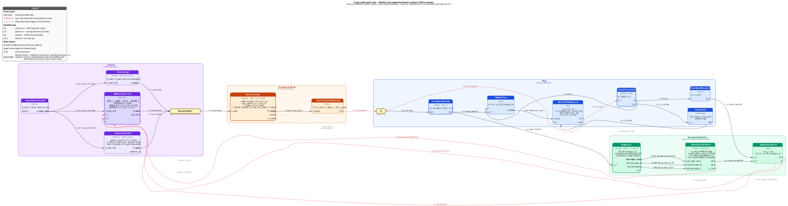

# Detailed Block Diagram — Phase C ABS Scenario

This is the Simulink-style companion to the at-a-glance mermaid diagram in
[README.md → Data flow](../README.md#data-flow). Every arrow carries its math
symbol, Python signal-bus name, units, and a sampling-type tag.

If the SVG above does not render in your viewer, see
[block-diagram.png](block-diagram.png).

Source: [`block-diagram.dot`](block-diagram.dot). Regenerate with
[`scripts/regenerate_diagram.sh`](../scripts/regenerate_diagram.sh).

## Legend

### Arrow styles

| Style | Meaning |
|---|---|
| solid black | signal produced earlier in the evaluation order — read fresh this step |
| dashed red | **lag-1**: block reads the previous step's value from the persistent-signals dict (breaks an algebraic loop) |
| dotted gray | diagnostic-only output — logged, not consumed by any downstream block |

### Sampling-type tags on edge labels

| Tag | Meaning |
|---|---|
| **(C)** | continuous — smooth RK4 integrator output |
| **(A)** | algebraic — recomputed fresh each step from current inputs |
| **(D)** | discrete — ZOH between updates; advanced in `commit()` once per step |
| **(D‑L)** | discrete + one-step lag — same as (D) but the consumer runs before the producer, so the value is read from the persistent dict |

### Block decoration

| Decoration | Meaning |
|---|---|
| double border | block owns continuous state (`∫`) integrated by the simulator's RK4 loop |
| single border | algebraic or discrete-only block |
| Σ circle | summing junction (e.g. `I_f · ω̇_f = +F_f·R_f − T_b`) |

## Simulator evaluation order (Phase C ABS scenario)

From `scenarios.py::build_phase_c_abs_panic_stop()`. Blocks are walked in this
order inside `Simulator._evaluate()`; a block reads inputs from the shared
`signals` dict, which starts each step as a copy of the persistent dict and is
updated in place as earlier blocks emit outputs.

| # | Block | Reads (fresh unless noted) | Writes |
|---|---|---|---|
| 1 | `VehicleTranslation` | `F_f` *(lag-1 from #9)* | `v`, `a_x` |
| 2 | `FrontWheelRotation` | `F_f` *(lag-1 from #9)*, `T_b` *(lag-1 from #10)* | `omega_f` |
| 3 | `RearWheelKinematics` | `v` | `omega_r` |
| 4 | `HumanBrakeController` | — | `V_pwm_cmd` |
| 5 | `ABSController` | `V_pwm_cmd`, `lambda_f_hat` *(lag-1 from #13)*, `omega_f_hat_dot` *(lag-1 from #12)*, `v_hat` *(lag-1 from #13)* | `V_pwm`, `abs_mode` |
| 6 | `MotorActuator` | `V_pwm` | `F_clamp`, `i_motor`, `omega_motor` |
| 7 | `NormalLoad` | `a_x` | `N_f` |
| 8 | `SlipRatioTrue` | `v`, `omega_f` | `lambda_f_true` |
| 9 | `BrushTireModel` | `lambda_f_true`, `N_f` | `F_f`, `lambda_crit` |
| 10 | `BrakeTorqueComputation` | `F_clamp` | `T_b` |
| 11 | `HallSensor` | `omega_f` | `theta_f`, `hall_edge_count`, `hall_last_edge_dt`, `hall_last_edge_t` |
| 12 | `WheelSpeedEstimator` | `hall_edge_count`, `hall_last_edge_dt`, `hall_last_edge_t` | `omega_f_hat`, `omega_f_hat_dot`, `omega_f_raw` |
| 13 | `SlipRatioEstimated` | `omega_r`, `omega_f_hat` | `lambda_f_hat`, `v_hat` |

**Lag-1 edges** (dashed red in the diagram, italicised above):

1. `BrushTireModel.F_f → VehicleTranslation`  and  `BrushTireModel.F_f → FrontWheelRotation`  — tire runs at #9, consumers at #1 and #2.
2. `BrakeTorqueComputation.T_b → FrontWheelRotation`  — brake at #10, wheel at #2.
3. `WheelSpeedEstimator.omega_f_hat_dot → ABSController`, `SlipRatioEstimated.lambda_f_hat → ABSController`, `SlipRatioEstimated.v_hat → ABSController` — estimator chain at #12–#13, ABS at #5.

Lag-1 is safe because `dt = 10⁻⁴ s` is three orders of magnitude below the
dominant hydraulic time constant (`τ_hyd = 30 ms`); see
[`ASSUMPTIONS.md` → Global §5](../ASSUMPTIONS.md#global).

## Full signal inventory

Every signal on the bus, one row each. All signal names are the exact string
keys that appear in the `signals: dict[str, float]` passed through
`Simulator._evaluate`.

| Python name | Symbol | Units | Producer | Consumer(s) | Sampling |
|---|---|---|---|---|---|
| `v` | v | m/s | `VehicleTranslation` (state) | `RearWheelKinematics`, `SlipRatioTrue` | C |
| `a_x` | a_x | m/s² | `VehicleTranslation` | `NormalLoad` | A |
| `omega_f` | ω_f | rad/s | `FrontWheelRotation` (state) | `SlipRatioTrue`, `HallSensor` | C |
| `omega_r` | ω_r | rad/s | `RearWheelKinematics` | `SlipRatioEstimated` | A |
| `N_f` | N_f | N | `NormalLoad` | `BrushTireModel` | A |
| `lambda_f_true` | λ_f,true | – | `SlipRatioTrue` | `BrushTireModel` | A |
| `F_f` | F_f | N | `BrushTireModel` | `VehicleTranslation` (D‑L), `FrontWheelRotation` (D‑L) | A at source, D‑L at consumer |
| `lambda_crit` | λ_crit | – | `BrushTireModel` | *(diagnostic only)* | A |
| `T_b` | T_b | N·m | `BrakeTorqueComputation` | `FrontWheelRotation` (D‑L) | A at source, D‑L at consumer |
| `F_clamp` | F_clamp | N | `MotorActuator` (state) | `BrakeTorqueComputation` | C |
| `i_motor` | i | A | `MotorActuator` (state) | *(diagnostic only)* | C |
| `omega_motor` | ω_m | rad/s | `MotorActuator` (state) | *(diagnostic only)* | C |
| `V_pwm_cmd` | V_cmd | V | `HumanBrakeController` | `ABSController` / `CadenceController` / `Passthrough` | A |
| `V_pwm` | V | V | `ABSController` / `CadenceController` / `Passthrough` | `MotorActuator` | A |
| `abs_mode` | mode | int (0–4) | `ABSController` | *(diagnostic only)* | D |
| `cadence_on` | on | {0, 1} | `CadenceController` | *(diagnostic only; Phase C cadence scenario)* | A |
| `theta_f` | θ_f | rad | `HallSensor` (state) | *(diagnostic only)* | C |
| `hall_edge_count` | N_edges | count | `HallSensor` | `WheelSpeedEstimator` | D |
| `hall_last_edge_dt` | Δt_edge | s | `HallSensor` | `WheelSpeedEstimator` | D |
| `hall_last_edge_t` | t_edge | s | `HallSensor` | `WheelSpeedEstimator` | D |
| `omega_f_hat` | ω̂_f | rad/s | `WheelSpeedEstimator` | `SlipRatioEstimated` | D |
| `omega_f_hat_dot` | ω̇̂_f | rad/s² | `WheelSpeedEstimator` | `ABSController` (D‑L) | D at source, D‑L at consumer |
| `omega_f_raw` | ω_raw | rad/s | `WheelSpeedEstimator` | *(diagnostic only)* | D |
| `lambda_f_hat` | λ̂_f | – | `SlipRatioEstimated` | `ABSController` (D‑L) | A at source, D‑L at consumer |
| `v_hat` | v̂ | m/s | `SlipRatioEstimated` | `ABSController` (D‑L) | A at source, D‑L at consumer |

## Per-block cards

### Control

**`HumanBrakeController`** — [`src/ebike_abs/control/human.py`](../src/ebike_abs/control/human.py)
- inputs: —
- outputs: `V_pwm_cmd` [V]
- state: none
- behaviour: `V_cmd = V_hold · min(1, t / t_rise)` — open-loop rider profile.

**`ABSController`** (Phase C) — [`src/ebike_abs/control/abs_fsm.py`](../src/ebike_abs/control/abs_fsm.py)
- inputs: `V_pwm_cmd` [V], `lambda_f_hat` [–], `omega_f_hat_dot` [rad/s²], `v_hat` [m/s]
- outputs: `V_pwm` [V], `abs_mode` [int]
- discrete state: FSM mode ∈ {APPLY, DUMP, HOLD, REAPPLY, BYPASS}, mode-entered timestamp
- trigger: `lambda_f_hat > λ_on ∧ omega_f_hat_dot < ω̇_trig`; exit DUMP on `lambda_f_hat < λ_off ∧ omega_f_hat_dot > 0`; BYPASS below `v_cutoff`.

**`CadenceController`** (Phase C alternative) — [`src/ebike_abs/control/cadence.py`](../src/ebike_abs/control/cadence.py)
- inputs: `V_pwm_cmd` [V]
- outputs: `V_pwm` [V], `cadence_on` [0/1]
- state: none (time-driven square-wave chop, 2 Hz × 50 % duty).

**`Passthrough`** (Phase B) — [`src/ebike_abs/control/human.py`](../src/ebike_abs/control/human.py)
- inputs: `V_pwm_cmd`; outputs: `V_pwm = V_pwm_cmd`. Used when no ABS/cadence gate is desired.

### Actuation & brake

**`MotorActuator`** — [`src/ebike_abs/blocks/actuator.py`](../src/ebike_abs/blocks/actuator.py)
- inputs: `V_pwm` [V]
- outputs: `F_clamp` [N] (clipped ≥ 0), `i_motor` [A], `omega_motor` [rad/s]
- continuous state (3): `i_motor`, `omega_motor`, `F_clamp`
- equations (PLAN.md §10): electrical → mechanical → lead-screw → hydraulic-lag cascade; `τ_hyd ≈ 30 ms` dominant.

**`BrakeTorqueComputation`** — [`src/ebike_abs/blocks/brake.py`](../src/ebike_abs/blocks/brake.py)
- inputs: `F_clamp` [N]
- outputs: `T_b` [N·m] `= μ_pad · F_clamp · r_eff · n_pads`

### Plant

**`VehicleTranslation`** — [`src/ebike_abs/blocks/vehicle.py`](../src/ebike_abs/blocks/vehicle.py)
- inputs: `F_f` [N] *(lag-1)*
- outputs: `v` [m/s], `a_x` [m/s²]
- continuous state (1): `v`
- equation: `m · dv/dt = −F_f` (drag/rr off by default).

**`FrontWheelRotation`** — [`src/ebike_abs/blocks/wheel.py`](../src/ebike_abs/blocks/wheel.py)
- inputs: `F_f` [N] *(lag-1)*, `T_b` [N·m] *(lag-1)*
- outputs: `omega_f` [rad/s]
- continuous state (1): `omega_f`
- equation: `I_f · dω_f/dt = +F_f·R_f − T_b`. **Sign note:** the `+F_f·R_f` term is what re-spins a locked wheel when `T_b` is released by an ABS DUMP — see [`ASSUMPTIONS.md` → FrontWheelRotation §3](../ASSUMPTIONS.md#frontwheelrotation).

**`RearWheelKinematics`** — [`src/ebike_abs/blocks/wheel.py`](../src/ebike_abs/blocks/wheel.py)
- inputs: `v` [m/s]
- outputs: `omega_r` [rad/s] `= v / R_r` (no state; front-only braking, λ_r = 0).

**`NormalLoad`** — [`src/ebike_abs/blocks/normal_load.py`](../src/ebike_abs/blocks/normal_load.py)
- inputs: `a_x` [m/s²]
- outputs: `N_f` [N] `= (m g a − m a_x h) / L`, clamped to [0, mg]

**`SlipRatioTrue`** — [`src/ebike_abs/blocks/slip.py`](../src/ebike_abs/blocks/slip.py)
- inputs: `v` [m/s], `omega_f` [rad/s]
- outputs: `lambda_f_true` [–] `= (v − ω_f·R_f) / max(v, v_ε)`

**`BrushTireModel`** (closed-form Dugoff) — [`src/ebike_abs/blocks/tire.py`](../src/ebike_abs/blocks/tire.py)
- inputs: `lambda_f_true` [–], `N_f` [N]
- outputs: `F_f` [N], `lambda_crit` [–] *(diagnostic)*
- smooth-saturated tire force; no piecewise branch (the `f(σ)` in Dugoff handles it).

### Sensing & estimation

**`HallSensor`** — [`src/ebike_abs/blocks/sensor.py`](../src/ebike_abs/blocks/sensor.py)
- inputs: `omega_f` [rad/s]
- outputs: `theta_f` [rad], `hall_edge_count` [count], `hall_last_edge_dt` [s], `hall_last_edge_t` [s]
- continuous state (1): `theta_f`
- discrete state: `edge_count`, `last_edge_t`, `last_edge_dt`, `next_edge_angle`
- N_hall = 20 → 18° resolution; edge times back-interpolated to O(dt²).

**`WheelSpeedEstimator`** — [`src/ebike_abs/blocks/sensor.py`](../src/ebike_abs/blocks/sensor.py)
- inputs: the three `hall_*` outputs
- outputs: `omega_f_hat` [rad/s], `omega_f_hat_dot` [rad/s²], `omega_f_raw` [rad/s]
- discrete state: last edge count, LPF state, MA ring buffer (window = 4), 3-sample history for central difference
- chain: raw edge rate → 50 Hz LPF → MA → central-difference derivative. Edge-timeout bound pulls `omega_f_hat` down when no edges arrive (locked wheel); see [`ASSUMPTIONS.md` → WheelSpeedEstimator](../ASSUMPTIONS.md) for the bound derivation.

**`SlipRatioEstimated`** — [`src/ebike_abs/blocks/slip.py`](../src/ebike_abs/blocks/slip.py)
- inputs: `omega_r` [rad/s], `omega_f_hat` [rad/s]
- outputs: `lambda_f_hat` [–], `v_hat` [m/s]
- `v_hat = ω_r · R_r`; `lambda_f_hat = (v̂ − ω̂_f·R_f) / max(v̂, v_ε)`.

## Phase A / Phase B deltas

The diagram shows the Phase C ABS scenario (the superset). The earlier phases
use the same block topology with substitutions:

- **Phase A** — `PrescribedClamp` stands in for `MotorActuator`; the
  sensing-and-estimation cluster and `HumanBrakeController` / `ABSController`
  are absent.
- **Phase B** — adds the sensor chain and `HumanBrakeController` + `Passthrough`
  (so the estimator runs but does not gate the actuator).
- **Phase C cadence** — replaces `ABSController` with `CadenceController`
  (time-driven square wave; no estimator feedback).

See `scripts/run_panic_stop.py --phase {a,b}` and `scripts/run_comparison.py`
for the corresponding runs.
