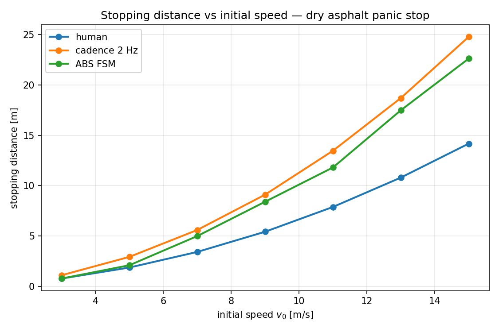
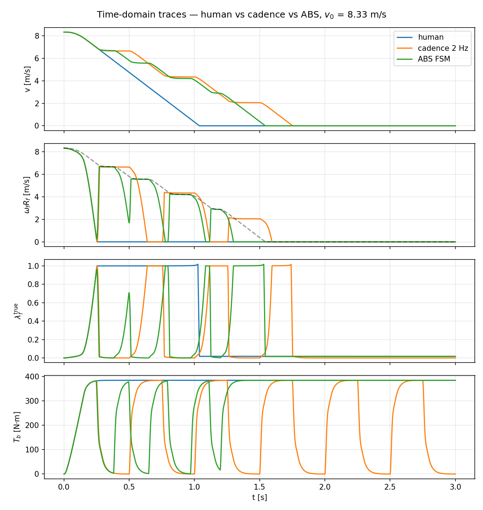
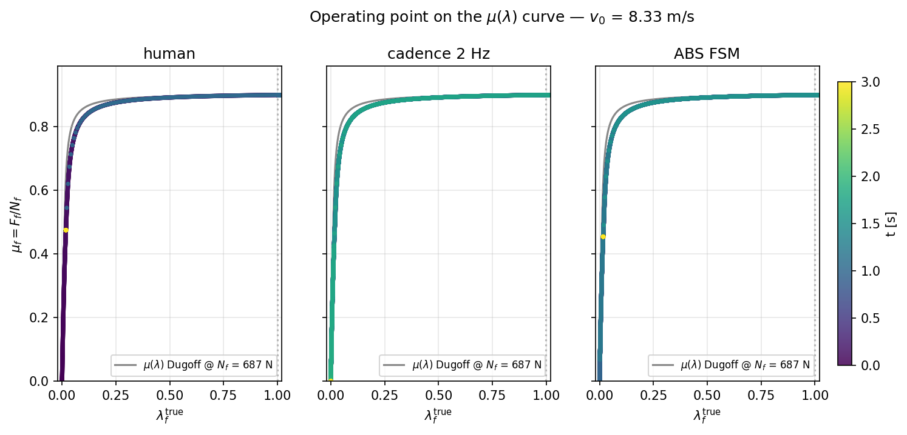

# Figure walkthrough — stopping distance, time traces, λ on μ(λ)

This document is the reader-facing caption layer for the three paper
figures produced by the `scripts/figure_*.py` scripts. Each section
takes one figure and answers three questions: *what happened*, *why*,
and *how the three strategies compare* on (a) stopping distance,
(b) peak slip / lock-up avoidance, and (c) brake force utilization.

The reference scenario throughout is the one defined by
`configs/default.toml`: a 120 kg cargo e-bike on dry asphalt
(`μ_peak = 0.9`, `C_x = 30 000 N/rad`), panic-stop from
`v₀ = 8.333 m/s ≈ 30 km/h`, fixed-step RK4 at `dt = 10⁻⁴ s`, 3 s
run. The full parameter table is in `docs/SIMULATION_SETUP.md`; the
per-strategy command laws are in `docs/CONTROL_STRATEGIES.md`; the
deeper "why doesn't ABS win on distance here?" argument is in
`docs/DISCUSSION.md` §6.

## Summary table at the reference speed

Numbers below are the verbatim output of
`python scripts/run_comparison.py` on `configs/default.toml`.

| strategy         | stopping distance [m] | time to stop [s] | max \|λ_f\| | lock-up                                        |
|------------------|----------------------:|-----------------:|------------:|------------------------------------------------|
| human (Phase B)  |                  4.71 |             1.02 |        1.02 | **sustained** — 72 % of above-cutoff time     |
| cadence 2 Hz     |                  7.81 |             1.73 |        1.02 | cyclic — 18 % of time, 2 Hz pattern           |
| ABS FSM          |                  7.22 |             1.52 |        1.02 | transient — 12 %, first-cycle spike only      |

**All three peak at `|λ| ≈ 1.0` briefly.** This is the documented MVP
estimator limitation: the 20-magnet Hall ring + 4-sample moving
average + 50 Hz LPF chain has ~20 ms of detection lag, so the first
lockup cycle spikes to `λ ≈ 1` before `ABSController.DUMP` fires
(`ASSUMPTIONS.md → ABSController §5`, `docs/CONTROL_STRATEGIES.md`,
"Known limitation"). What distinguishes the three strategies therefore
isn't the peak slip — it's the *fraction of the run spent there*, which
is what the lock-up column quantifies.

## Figure 1 — stopping distance vs initial speed

**(a) What happened.** Three monotonically-increasing curves. At every
sampled `v₀ ∈ {3, 5, 7, 9, 11, 13, 15} m/s` the ordering is the same:
**human shortest, ABS next, cadence longest.** The gap widens with
speed — at 3 m/s the human and ABS curves are within 0.00 m of each
other, but at 15 m/s cadence is ~10 m longer than human and ~2 m
longer than ABS.

**(b) Why.** The culprit is the tyre model. The closed-form Dugoff
block (`src/ebike_abs/blocks/tire.py:43`) saturates to
`F_f → μ_peak · N_f` as `λ → 1` — a locked wheel slides at *peak*
friction, not sliding friction. So the locked human baseline is
coincidentally distance-optimal *in this model*, while ABS and cadence
spend chunks of every second at lower-than-peak μ: ABS during `DUMP` /
`HOLD` after the estimator flags a lockup, cadence during its 50 %
off-phase. This is the "Dugoff null result on high-μ" documented in
`docs/DISCUSSION.md` §6.1. The real-world story flips when
`μ_slide < μ_peak`; that extension is deferred to the low-μ follow-up
plan at `~/.claude/plans/low-mu-results.md`.

**(c) How they compare.**

- **Stopping distance.** Human wins at every v₀ in this model. At
  the reference 8.33 m/s: 4.71 / 7.22 / 7.81 m for human / ABS /
  cadence. ABS beats cadence by ~7.5 %; both pay ~3 m vs locked
  human.
- **Peak slip / lock-up avoidance.** Not visible on this figure
  alone — see Fig 2's λ panel and the lock-up column of the summary
  table, which *reverses* the distance ordering: ABS is strictly
  best on controllability (12 % locked time vs 72 % for human).
- **Brake force utilization.** ABS extracts the most μ-per-unit-time
  *while the wheel is still rolling*, which is why its curve sits
  ~0.6 m under cadence's despite both being "modulating" strategies.
  Cadence's chop is time-driven (open-loop at 2 Hz), so it spends
  half of every cycle at zero brake force regardless of whether the
  tyre needs a release; ABS's chop is event-driven and only dumps
  when `λ̂_f > λ_on = 0.20` and `ω̂̇_f < −100 rad/s²` both hold
  (see `src/ebike_abs/control/abs_fsm.py`).

Raw numbers for the full sweep are in
`out/figures/figure_1_stopping_distance.csv`.

## Figure 2 — time-domain traces at 30 km/h

Four stacked panels, shared x-axis, three strategies overlaid:
`v(t)`, `ω_f(t) · R_f` (rim speed, directly comparable to v),
`λ_f^true(t)`, `T_b(t)` (brake torque delivered to the front rotor).

**(a) What happened.**

- **`v(t)`.** Human's curve falls fastest and cleanest, ending near
  t ≈ 1.02 s. Cadence has a stair-step deceleration — flat v during
  each OFF half-cycle. ABS decelerates smoothly with shallow notches
  at each `APPLY → DUMP` transition.
- **`ω_f · R_f`.** Human crashes to 0 at t ≈ 0.25 s and stays
  there — the locked-wheel signature. Cadence oscillates between 0
  and ~v twice per second, matching the `cadence.freq = 2 Hz`
  square-wave schedule. ABS tracks `v` with ~10–15 % under-spin
  (the steady-state slip at the μ peak), with brief dips on each
  `DUMP → HOLD` recovery.
- **`λ_f^true`.** Human pins at 1 after the first wheel-stop event.
  Cadence sawtooths between ~0 and ~1 at 2 Hz. ABS hovers near
  0.1–0.2 after one first-cycle spike to ~1.
- **`T_b`.** Human is a linear ramp from 0 to ~120 N·m over
  `t_rise = 0.15 s` (matching `V_hold = 6 V` through the steady-state
  `F_clamp^ss ≈ 6860 N`), then holds flat. Cadence is a clean 2 Hz
  square at the same ~120 N·m peak. ABS has an irregular waveform
  driven entirely by FSM mode transitions.

**(b) Why.** Each waveform is the direct signature of its command
law (`docs/CONTROL_STRATEGIES.md`). Human is open-loop ramp-and-hold
on `V_pwm` → one `T_b` plateau downstream of the motor/hydraulic
chain. Cadence chops `V_pwm` at fixed 2 Hz → a square `T_b` with the
`τ_hyd = 30 ms` hydraulic lag visibly rounding the rising/falling
edges. ABS gates `V_pwm` on `λ̂_f` and `ω̂̇_f` feedback → irregular
`T_b` that responds to what the tyre is actually doing.

**(c) How they compare.**

- **Stopping distance.** Read off as the area under `v(t)`. Human's
  curve terminates first (shortest integral); ABS second; cadence
  last.
- **Peak slip / lock-up avoidance.** Read off the `λ` panel. Human
  is pinned at 1 for three-quarters of the run (no steering authority
  for that duration); cadence crosses through 1 on every cycle; ABS
  is above 0.5 only during the first-cycle detection-lag spike.
- **Brake force utilization.** Read off the `T_b` panel. Human
  delivers maximum average torque but zero modulation. Cadence
  delivers exactly 50 % average torque, independent of whether the
  wheel is rolling or locked — the same chop pattern whether the
  tyre is saturated or in the linear regime. ABS is the only
  waveform whose *shape* depends on tyre state; that is literally
  what "closed-loop" means in this study.

## Figure 3 — operating point on the μ(λ) curve

Three side-by-side panels, one per strategy. Each panel shows the
static Dugoff `μ(λ)` curve (computed at the rest-state nominal
`N_f ≈ 687 N` via `DugoffTireModel._compute`, `tire.py:43`) as a grey
background, with the actual sim-run `(λ_f^true(t),
μ_f(t) = F_f(t) / N_f(t))` trajectory overlaid and coloured by time.

**(a) What happened.**

- **Human.** Trajectory launches at (0, 0), sweeps rightward *past*
  the μ peak (at `λ ≈ 0.10–0.15`), and parks at `λ = 1` for the rest
  of the run — a single dense cluster at the far right of the plot.
- **Cadence.** Sweeps rightward during ON phases (crossing the peak,
  overshooting to `λ ≈ 1`) and returns toward `λ ≈ 0` during OFF
  phases. The 2 Hz oscillation shows up as two complete loops per
  second traced across the μ curve.
- **ABS.** After one first-cycle excursion to `λ ≈ 1` (the
  detection-lag spike), the trajectory collapses into a tight cluster
  hovering just past the μ peak, in the `λ ≈ 0.1–0.2` band where the
  FSM's `λ_on = 0.20 / λ_off = 0.05` hysteresis lives.

**(b) Why.** This is the tyre-frame view of the same three runs. The
ABS FSM's design intent is literally "keep the operating point near
the μ peak" — `λ_on = 0.20` was chosen just past the peak so that
noise in `λ̂_f` can't false-trigger, and `λ_off = 0.05` is safely
inside the linear regime so the exit condition only fires after real
recovery (`docs/CONTROL_STRATEGIES.md` §3, "Parameter choices"). The
figure shows the design works as specified, modulo the first-cycle
sensor lag. Human's cluster at `λ = 1` and Dugoff's saturation to
`μ_peak · N_f` there is the visual core of the "null result" —
locked and peak-μ operating points sit at the *same μ level* in this
model.

**(c) How they compare.**

- **Stopping distance.** In the current Dugoff model all three
  trajectories reach μ ≈ μ_peak at some point — human stays there
  (minimal wasted distance), ABS returns to it each cycle, cadence
  only visits it twice per second. Dugoff-peak = Dugoff-slide is
  why the human cluster's vertical position equals the ABS
  cluster's, and why human wins on distance.
- **Peak slip / lock-up avoidance.** ABS is the only strategy whose
  cluster avoids `λ = 1` *after* the first cycle. Human lives
  there; cadence visits twice a second. The horizontal position of
  each cluster is the single best summary of controllability.
- **Brake force utilization.** The vertical coordinate of the
  trajectory is instantaneous `μ_f = F_f / N_f`. All three strategies
  briefly reach peak μ. The *time-weighted fraction* of samples at
  or near the peak is highest for ABS (tight cluster), lowest for
  cadence (half of each cycle is in the low-λ low-μ regime), and
  the human baseline is a degenerate case — all samples concentrated
  at `(λ = 1, μ = μ_peak)`.

## Cross-figure summary

The three figures are three views of one run:

- Fig 1 is the headline — what you'd show first. It establishes
  that distance ordering is **human < ABS < cadence** at every
  speed, and that the gap widens with `v₀`.
- Fig 2 explains the mechanism in the time domain — you can see
  *when* each strategy is at peak μ, *when* it is in lockup, and
  *when* the brake is actually applying force.
- Fig 3 localises the operating points on the tyre curve itself —
  it shows what the FSM is trying to do (cluster near the peak) and
  shows that human's locked cluster sits at the same μ level as
  ABS's peak-tracking cluster, which is exactly the property that
  makes the Dugoff model give the null result.

The headline take-away is that **the distance ordering in Fig 1 is a
property of the Dugoff tyre model's peak = sliding μ assumption, not
a property of the controllers.** The controllability ranking —
ABS > cadence > human — is the real finding of the study on dry
asphalt, and it is visible in Figs 2–3 long before any numbers come
out of the integrator.

For what changes when `μ_slide < μ_peak` (i.e., when the tyre model
distinguishes sliding from peak friction, as happens on wet asphalt
and gravel in reality), see the deferred Phase D plan at
`~/.claude/plans/low-mu-results.md`.
